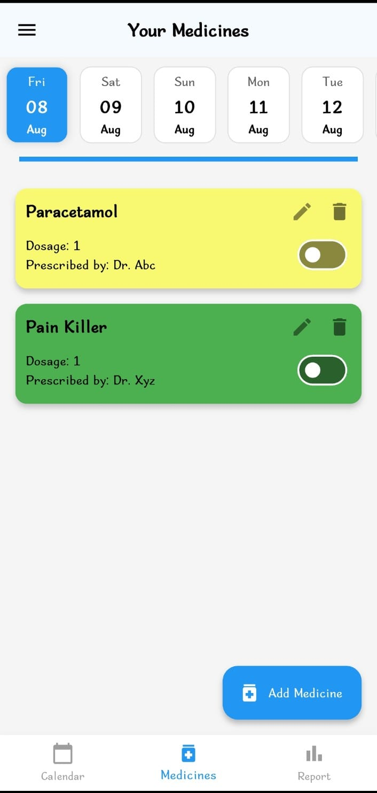
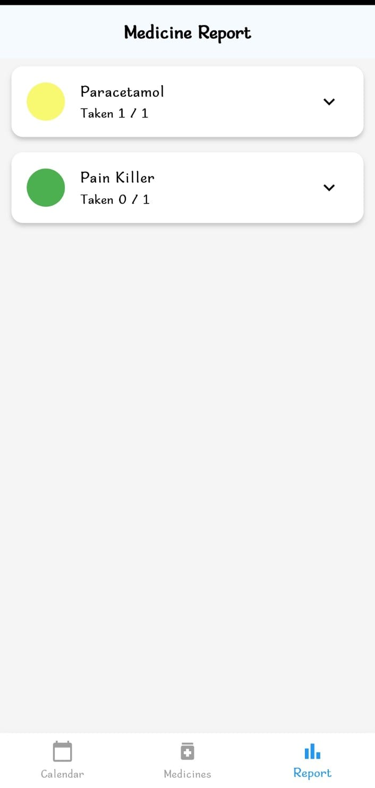
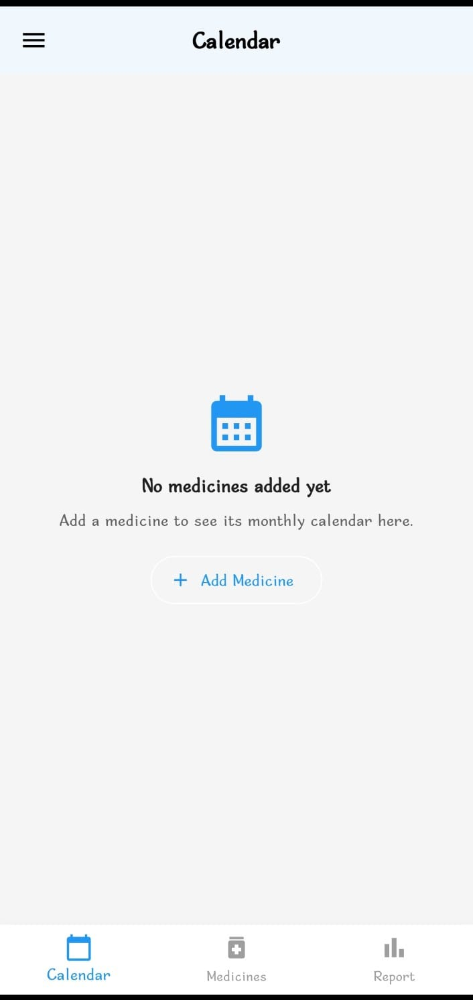

# 💊 MediMonitor

## 📖 Description
**MediMonitor** is a **Flutter + Firebase** mobile application designed to help users efficiently track and manage their medication schedules.  
It provides a **calendar-based view**, **PDF reports**, and the ability to **share medicine schedules with others** in read-only mode.  

This app is especially useful for:
- People who take multiple medicines daily
- Caretakers managing schedules for others
- Health professionals who monitor patients remotely

---

## 🎯 Purpose
The goal of this app is to make **medicine management simple, organized, and accessible**, ensuring users never miss a dose and can maintain a clear record of their medication history.

---

## ⚡ Key Functionalities

### 1️⃣ Medicine Management
- Add, edit, and delete medicines  
- Set dosage, doctor’s name, and start date  
- Select schedule type: daily, weekly, or custom intervals  

### 2️⃣ Calendar View
- Color-coded days for taken/missed doses  
- Monthly navigation to review past history  

### 3️⃣ View-Only Mode (Share Code Feature)
- Generate a **6-digit share code**  
- Allow others to track medicines in **read-only mode**  
- Instantly switch between self-tracking and tracking someone else  

### 4️⃣ Reports
- Generate **PDF reports** of medicine history  
- Monthly breakdown with taken/missed indicators  

### 5️⃣ Offline Support
- View previously loaded data even without internet connection  

---

## 📌 Use Cases
- **Patients** – Track personal medication schedules and avoid missed doses.  
- **Caretakers** – Monitor medicines for elderly family members or patients remotely.  
- **Parents** – Manage and track children’s prescribed medicines.  
- **Doctors/Pharmacists** – Review medication history for better consultations.  

---

## 🛠 Technology Stack

### 📱 Frontend
  
  

### ☁ Backend & Database
  
  

### ⚙ State Management
  
*(Easily scalable to BLoC for complex workflows)*

### 💾 Local Storage

### 📄 Reporting

### 🖥 Platforms
  

---

## 📥 Download
You can download the latest APK here:  
[📥 **Download MediMonitor v1.0**](release/MediMonitor.apk)

---

## 📸 Screenshots

| Home Screen | Report Screen | Calendar View |
|-------------|--------------|---------------|
|  |  |  |

---
